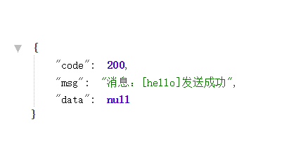

# kafka demo

## 启动
依次启动zookeeper、kafka，然后运行项目。

访问http://localhost:8080/send?msg=hello

显示如下表示启动成功。




## 说明 & 步骤
1.引入maven依赖，这里使用的是spring的，它包装了apache的kafka-client
``` xml
<dependency>
    <groupId>org.springframework.kafka</groupId>
    <artifactId>spring-kafka</artifactId>
    <version>2.2.6.RELEASE</version>
</dependency>
```

2.在application.properties中添加配置
```properties
#kafka相关配置
spring.kafka.bootstrap-servers=localhost:9092
#设置一个默认组
spring.kafka.consumer.group-id=0
# 设定 KafkaProducer 对应的客户端id，默认值为""
spring.kafka.client-id=producer.client.id.demo

#key-value序列化反序列化
spring.kafka.consumer.key-deserializer=org.apache.kafka.common.serialization.StringDeserializer
spring.kafka.consumer.value-deserializer=org.apache.kafka.common.serialization.StringDeserializer
spring.kafka.producer.key-serializer=org.apache.kafka.common.serialization.StringSerializer
spring.kafka.producer.value-serializer=org.apache.kafka.common.serialization.StringSerializer
#每次批量发送消息的数量
spring.kafka.producer.batch-size=65536
spring.kafka.producer.buffer-memory=524288

# producer
spring.kafka.producer.bootstrap-servers=localhost:9092
# 重试次数，默认为0
spring.kafka.producer.retries=0

# cousumer
spring.kafka.consumer.bootstrap-servers=localhost:9092
spring.kafka.template.default-topic=test
spring.kafka.consumer.enable-auto-commit=true
spring.kafka.consumer.auto-offset-reset=latest
```

3.创建消费者
```java
@Slf4j
@Component
public class Consumer {


    /**
     * 消费者订阅消息
     * @param record
     */
    @KafkaListener(topics = "test")
    public void listen(ConsumerRecord<?, ?> record) {
        log.info("kafka -> topic = {}, offset = {}, key = {}, value = {}", record.topic(), record.offset(), record.key(), record.value());

    }
}
```

4.使用生产者发送消息
```java
@RestController
@Slf4j
public class HelloController {

    @Autowired
    private KafkaTemplate<String,String> kafkaTemplate;

    @GetMapping("/send")
    public Response sendKafka(String msg) {
        Random random = new Random();
        try {
            // 作为生产者生产一条消息
            log.info("kafka -> 生成一条消息={}", msg);
            kafkaTemplate.send("test", "random-key-" + random.nextInt(100), msg);
            log.info("消息[{}]发送成功", msg);
            return Response.success("消息：[" + msg + "]发送成功", null);
        } catch (Exception e) {
            log.error("发送kafka失败", e);
            return Response.error("发送kafka失败", null);
        }

    }
}

```


## 遇到的问题
java.nio.file.FileSystemException: D:\XXXX\kafka-logs\__consumer_offsets-9\00000000000000000000.timeindex: 另一个程序正在使用此文件，进程无法访问。

把对应的日志文件夹删除就解决了。(例如，删除文件夹softwarekafka_2.12-2.2.0kafka_2.12-2.2.0logs)
